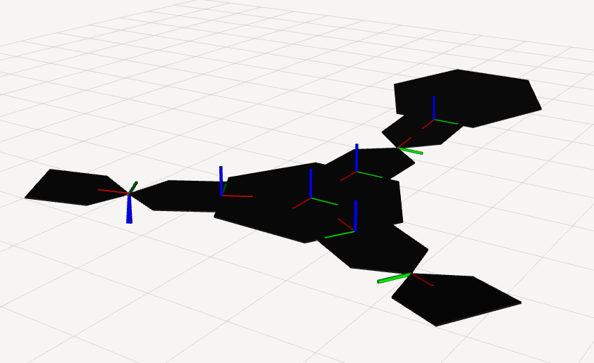

Robogami description package
================

This package contains the robot description for the Robogami robot.

It is an essential software component to use Robogami with [mc_rtc](https://jrl-umi3218.github.io/mc_rtc/) control framework.

## Usage

First follow the [mc_rtc instalation instructions](https://jrl.cnrs.fr/mc_rtc/tutorials/introduction/installation-guide.html).

### Clone

Once mc_rtc is installed, clone this repository into a folder called `catkin_data_ws/src/mc_rtc_data/`

```
git clone git@github.com:anastasiabolotnikova/robogami_description.git
```

### Build

Go to the root of the ROS2 worksapce `catkin_data_ws` and run

```
colcon build
```

if you get `ERROR:colcon:colcon build: The install directory 'install' was created with the layout 'merged'` run

```
colcon build --merge-install
```

### Visualize

```
ros2 launch robogami_description show_urdf.py
```



## Generate custom Robogami description

To control a Robogami module with dimensions different from the ones indicated in the [robogami_config_baseline.yaml](etc/robogami_config_baseline.yaml), follow these steps:

1. Specify your Robogami module dimensions in the [robogami_config_custom.yaml](etc/robogami_config_custom.yaml)
1. Run the [URDF generating script](src/generate_urdf.py) 
`python3 generate_urdf.py ../etc/robogami_config_custom.yaml`
1. (Recommended) See how it worked out: `ros2 launch robogami_description show_urdf.py urdf_file:=/urdf/robogami_custom.urdf`
1. Rebuild ROS2 workspace to install new robot description `colcon build`